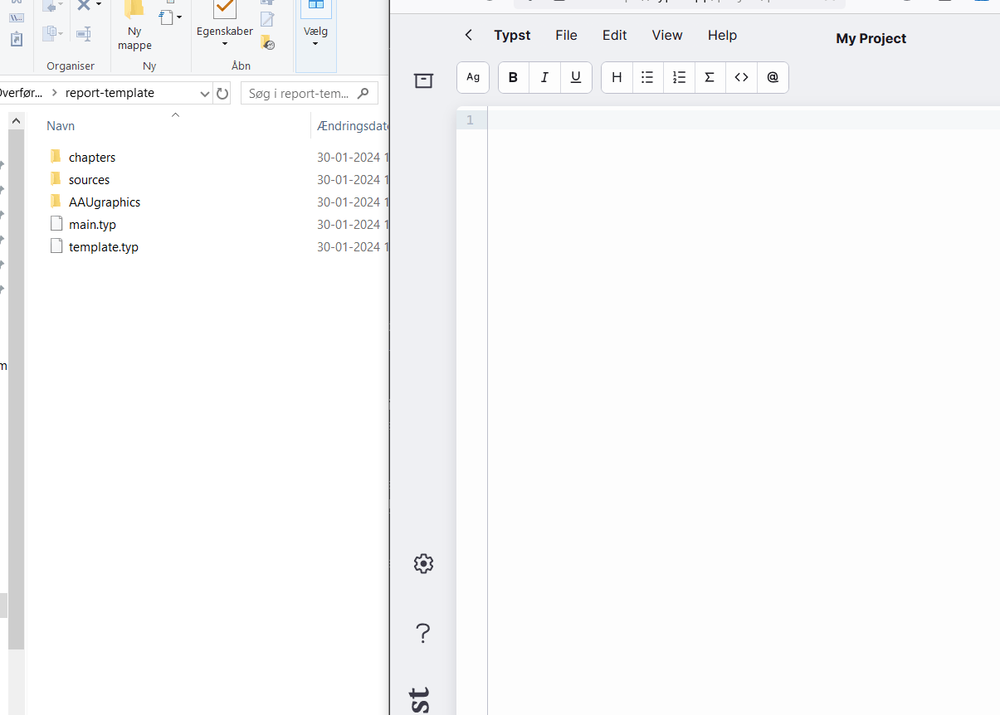

# AAU Typst Template
The widely used AAU LaTeX report template, rewritten in Typst.

## Template Overview
This project contains the following templates:

 - `Report template`

This is the general template, it contains good examples of how to use Typst for common tasks.

 - `Report template (empty)` (based on `Report template`)

This is an empty version of the report template. It doesn't contain examples, only filled with lorem ipsum.

 - `Singlepage Template` (based on `Report template`)

This template shows how to use the template without 'complicated' folder structure.

### Where to get the templates
The templates are generated for each commit, and every release. You can get the latest 'stable'-template on [releases page](https://github.com/krestenlaust/AAU-Typst-Template/releases).

Every release and commit also contains artifacts with compiled versions (PDFs) to show how they're going to look.

### Using a template with [Typst.app](https://typst.app/)
If you've just barely convinced your group to make use of Typst, then using the web app is probably ideal. It will be familar to Overleaf users, as it resembles a lot, just without all the UI clutter.

#### This shows how to import the `Report template`:

Typst.app doesn't currently support dragging folders, therefore the folders should be created manually, and files dragged in accordingly. **Folder name casing is important.**

## Template Structure
This is an overview of the folders/files in the root of this repository:

Each template contains the following:

 - `AAUgraphics`
Contains the graphics used in the template.

 - `main.typ`
This is the main source, it includes any other files, and this file is the sole target for the compiler, if you want to compile locally, run `typst compile main.typ`.

 - `template.typ`
The main template file. This file is located in `report-template` (and a copy is stored in `singlefile-template`).
This file uses the graphics located in `AAUgraphics`.

## Inspiration
This project replicates the (semi-official) AAU report template located at [jkjaer/aauLatexTemplates](https://github.com/jkjaer/aauLatexTemplates).

If you still insist on using LaTeX, then my good friend, [@Tosuma](https://www.github.com/Tosuma), has improved the AAU LaTeX template considerately: [Tosuma/AAU-Latex-Template-English](https://github.com/Tosuma/AAU-Latex-Template-English).

## Contribution
Any contribution is welcome!
